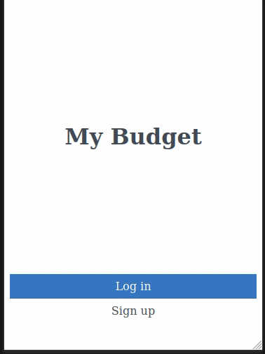

# Budget app

> The Budget app is a mobile web application where you can manage your budget: you have a list of transactions associated with a category, so that you can see how much money you spent and on what.


## Built With

- _**Ruby**_
- _**Rails**_
- _**PostgreSQL**_

### Preview



## Live Demo

[Live Demo Link](https://thawing-sierra-32352.herokuapp.com/)

## Getting Started

### Clone this repository

```bash
$ git@github.com:Sahar-AbdelSamad/budget-app.git
$ cd budget-app
```
### Install gems
```bash
$ bundle install
```

### Setup database
```bash
$ rails db:create
$ rails db:migrate
```

### Start server
```bash
$ rails s
```
Open http://localhost:3000/ in your browser

### Run tests
```bash
$ bundle exec rspec
```

## Authors

👤 **Sahar Abdel Samad**

- GitHub: [@sahar-abdelsamad](https://github.com/Sahar-AbdelSamad)
- Twitter: [@abdelsamadsahar](https://twitter.com/AbdelSamadSahar)
- LinkedIn: [sahar-abdel-samad](https://www.linkedin.com/in/sahar-abdel-samad/)

## 🤝 Contributing

Contributions, issues, and feature requests are welcome!

## Show your support

Give a ⭐️ if you like this project!

## Acknowledgments

[Original design](https://www.behance.net/gallery/19759151/Snapscan-iOs-design-and-branding?tracking_source=) idea by [Gregoire Vella on Behance](https://www.behance.net/gregoirevella)